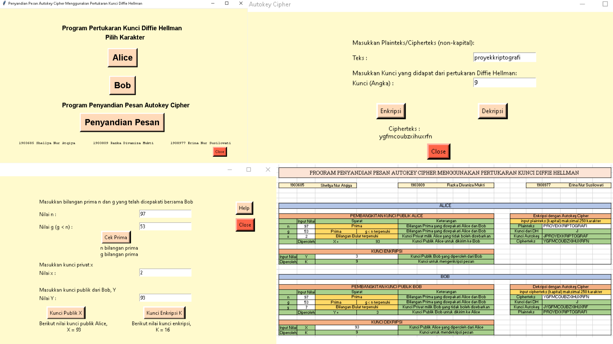
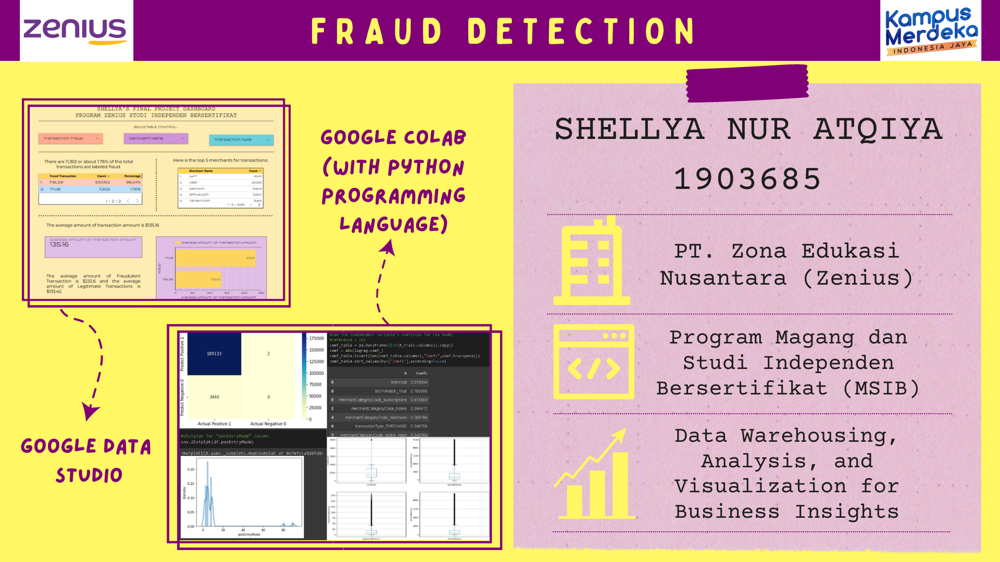

# Portfolio

---
---

# College Project

### Final Project Kriptografi
#### Penyandian Pesan Autokey Cipher Menggunakan Pertukaran Kunci Difie-Hellman
- [Python](https://drive.google.com/file/d/1oGeeAur8dfvzMr4ruQsNa5kVv-P7rW-q/view?usp=sharing)
- [Download Python](/kuliah/Diffie Hellman Autokey Cipher.py)
- [Excel](https://docs.google.com/spreadsheets/d/1W6SY8u5yhsTy0QPGemqtvYQcbKTUhQ2-/edit?usp=sharing&ouid=110868733058254967789&rtpof=true&sd=true)

- Score: 96/100
- Average Score: 93.3/100

---
---

# Program Zenius Studi Independen Bersertifikat (MBKM)
Data Warehousing, Analysis, and Visualization for Business Insights

---

## Specific Skills (Data Analysis)

- [Assignment 1 - Dynamic Pricing (PDF)](/tugas/Asesmen I - Dynamic Pricing.pdf)
- [Assignment 5 - Data Cleansing (PDF)](/tugas/AsesmenTopic5PPT.pdf)
- [Assignment 6 - Introduction to Data Preprocessing (IPYNB)](https://drive.google.com/file/d/1-b8TGfFM0VK-Q3SBX164OZ4NuVBmaJSX/view?usp=sharing)
- [Assignment 7 - Introduction to Data Visualization (PDF)](/tugas/7-DV.pdf)
- [Assignment 9 - Introduction to Statistics (IPYNB)](https://drive.google.com/file/d/12vWWsCnidbYn51239g8uqACYYGR-p7PG/view?usp=sharing)
- [Assignment 13 - House Price Model (IPYNB)](https://colab.research.google.com/drive/1FTRPYbKXzVY3ApbhRbVYb_EcruzA3zbX?usp=sharing)
- [Assignment 16 - SQL (PDF)](/tugas/16-SQL.pdf)
##### for IPYNB file please open with Google Colaboratory

#### Final Project - Fraud Detection
- [Google Colaboratory](https://colab.research.google.com/drive/1xHWIGOgDqfsyZRNIWkoNeq5NEsy6XCFD?usp=sharing)
- [Dashboard (PDF)](/tugas/Final_Project_Shel.pdf)
- [Dashboard (Google Data Studio)](https://datastudio.google.com/reporting/da17ce10-3aea-4c78-adad-c3c3d8268698) 

---
# Writing

## Fundamental Skills Program Zenius Studi Independen Bersertifikat

#### 1. Penalaran dan Pemahaman Bacaan
##### [Usaha Tidak Akan (Benar-benar) Mengkhianati Hasil](/fundamental/EsaiPemahamanBacaan.pdf)
- Score: 65/100
- Average Score: 20.8/100

#### 2. Filsafat Dasar
##### [Cabang Filsafat](/fundamental/CabangFilsafat.pdf)
- Score: 87/100
- Average Score: 85.31/100
##### [Sejarah Filsafat](/fundamental/SejarahFilsafat.pdf)
- Score: 98.25/100
- Average Score: 85.6/100

#### 3. Evolusi Manusia
##### [Evolusi Manusia](/fundamental/EvolusiManusia.pdf)
- Score: 92/100
- Average Score: 77.2/100

## Creative Writing
[News, Movie Recommendation, Personal](/pdf/Writer_Shel.pdf)

---
---

Page template forked from <a href="https://github.com/evanca/quick-portfolio">evanca</a>

<!-- Remove above link if you don't want to attibute -->
