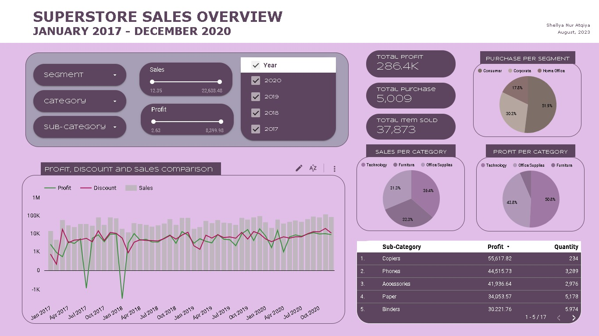
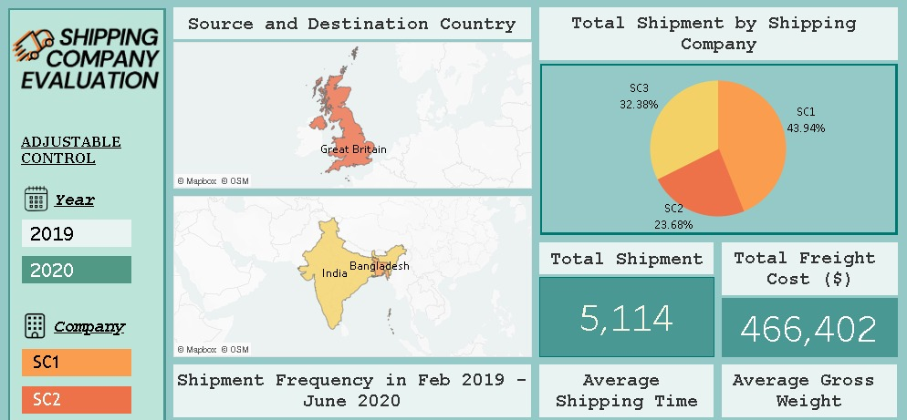
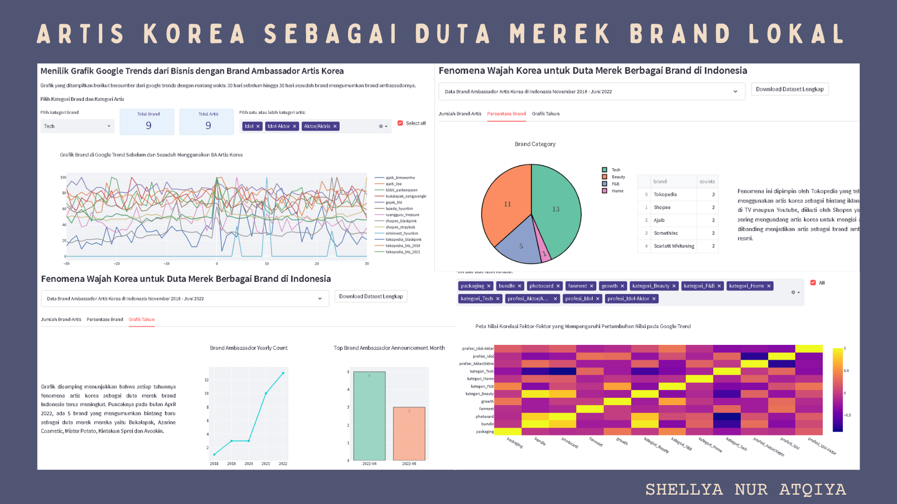
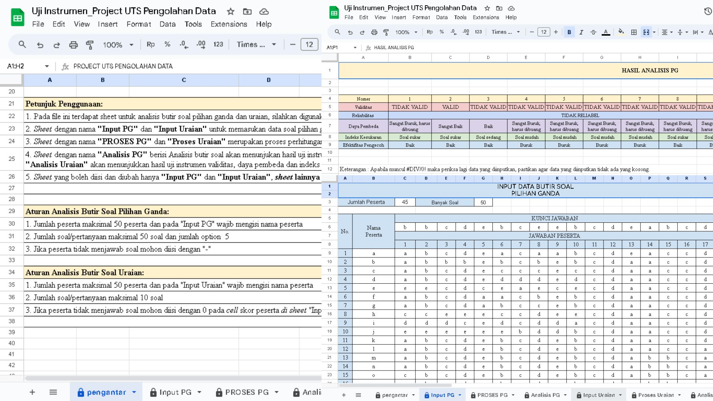
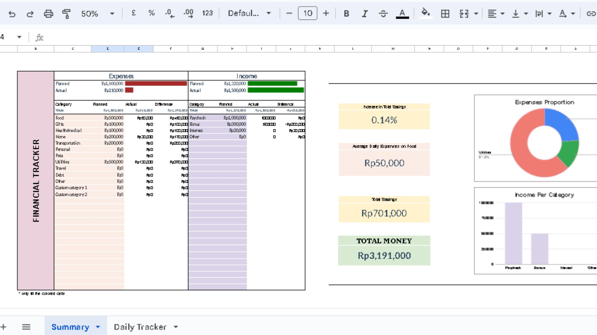
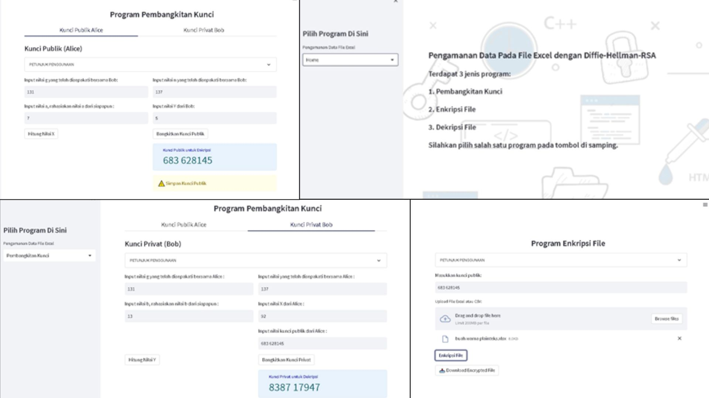

# Shellya Nur Atqiya's Portfolio

---
---

## Data Science and Analytics

### > [Looker - Superstore Sales Overview](https://lookerstudio.google.com/reporting/1f0c494a-da99-42c0-adfd-03577a4501ee)
  The dashboard serves as a tool for assessing product sales performance through the visualization of relevant data. Its primary purpose is to provide decision-makers and stakeholders with a clear and intuitive representation of key sales metrics and trends. In a professional context, this dashboard enables a streamlined and data-driven approach to evaluate product sales within the superstore. 

  
  
### >  [Tableau - Shipping Company Evaluation](https://public.tableau.com/app/profile/shellya.nur.atqiya/viz/ShippingDashboard_16912405398230/Dashboard1)
  The primary objective of this project was to gain valuable insights into the efficiency and cost optimization strategies employed by different shipping companies. By visualizing key performance indicators (KPIs) and trends, the dashboard offers a comprehensive understanding of the shipping industry's dynamics during a specific timeframe.

  
  
### > [Streamlit - Final Project Tetris : Artis Korea sebagai Duta Merek Brand Lokal](https://shellyanat-ba-korea-finalproject-b40wja.streamlitapp.com/)
  In June 2022, 30 Korean Artists took on the role of Brand Ambassadors for various Indonesian businesses. This project delves into Google trends to analyze the correlation between their influence and brand awareness with the help of marketing strategies. 

  
  
  
### > [Looker - Final Project PZSIB : Fraud Detection](https://datastudio.google.com/reporting/da17ce10-3aea-4c78-adad-c3c3d8268698) 
  
### > [Google Colaboratory - Final Project PZSIB : Fraud Detection](https://colab.research.google.com/drive/12Y1byfM0kJzw-_G8Jbux5ZGvYVltJwl7?usp=sharing)
  Fraud Detection is the final project of the study path "Data Warehousing, Analysis, and Visualization for Business Insights" from the Merdeka Campus Program by Zenius. Students need to create visualizations based on multiple questions and utilize machine learning techniques to find the key variables that impact fraud detection in transactions.
  
  

### > [Spreadsheet - College Project : Validity and Reliability in Classroom Assesment](https://docs.google.com/spreadsheets/d/17ROx197Hn6dBLs0wpRpprwfGK2VkLrK0bUHcvgMtiU4/edit?usp=sharing)
  In the field of classroom assessment instruments and educational research, the concepts of validity and reliability are very important. These two aspects are the basis for ensuring that the assessment used to measure student learning outcomes is a strong and credible assessment, thereby increasing the credibility of research findings. These spreadsheets are designed as templates to facilitate a structured assessment process, allowing educators and researchers to efficiently evaluate the validity and reliability of their assessments.

  

### > [Spreadsheet : Monthly Financial Report Template](https://docs.google.com/spreadsheets/d/15wVg1JnIMESh32_ESx3o-EWsAv7bRGImFXEE9WGm4IY/edit?usp=sharing)
  The "Monthly Financial Report" template includes sections for expenses, income, savings, and details about the use of different wallets or financial accounts. This template serves as a tool for tracking, analyzing, and reporting on monthly financial activities. It provides a clear overview of financial report and monitor progress toward financial goals. Additionally, it can be modified by the user according to their needs.
  
  

### > Courses Assignment

#### Program Zenius Studi Independen Bersertifikat (MBKM)
- [Assignment 1 - Dynamic Pricing (PDF)](/tugas/Asesmen I - Dynamic Pricing.pdf)
- [Assignment 5 - Data Cleansing (PDF)](/tugas/AsesmenTopic5PPT.pdf)
- [Assignment 6 - Introduction to Data Preprocessing (IPYNB)](https://drive.google.com/file/d/1-b8TGfFM0VK-Q3SBX164OZ4NuVBmaJSX/view?usp=sharing)
- [Assignment 7 - Introduction to Data Visualization (PDF)](/tugas/7-DV.pdf)
- [Assignment 9 - Introduction to Statistics (IPYNB)](https://drive.google.com/file/d/12vWWsCnidbYn51239g8uqACYYGR-p7PG/view?usp=sharing)
- [Assignment 13 - House Price Model (IPYNB)](https://colab.research.google.com/drive/1FTRPYbKXzVY3ApbhRbVYb_EcruzA3zbX?usp=sharing)
- [Assignment 16 - SQL (PDF)](/tugas/16-SQL.pdf)
###### for IPYNB file please open with Google Colaboratory

#### Tetris (Data Analyst Fast Track Program by DQLab)
- [Case Study SQL (PDF)](/tugas/SQLTetris.pdf)

---
---

## Kriptografi 
### > [Implementasi Kriptografi dalam Pengamanan Data pada File Excel dengan Diffie-Hellman-RSA](https://shellya-kriptografi-excel.streamlit.app/)

### > Penyandian Pesan Autokey Cipher Menggunakan Pertukaran Kunci Diffie-Hellman
- [Python](https://drive.google.com/file/d/1oGeeAur8dfvzMr4ruQsNa5kVv-P7rW-q/view?usp=sharing)
- [Download Python](/kuliah/Diffie Hellman Autokey Cipher.py)
- [Excel](https://docs.google.com/spreadsheets/d/1W6SY8u5yhsTy0QPGemqtvYQcbKTUhQ2-/edit?usp=sharing&ouid=110868733058254967789&rtpof=true&sd=true)

- Score: 96/100
- Average Score: 93.3/100

---
---
## Writing

### Fundamental Skills Program Zenius Studi Independen Bersertifikat (MBKM)

#### 1. Penalaran dan Pemahaman Bacaan
##### [Usaha Tidak Akan (Benar-benar) Mengkhianati Hasil](/fundamental/EsaiPemahamanBacaan.pdf)
- Score: 65/100
- Average Score: 20.8/100

#### 2. Filsafat Dasar
##### [Cabang Filsafat](/fundamental/CabangFilsafat.pdf)
- Score: 87/100
- Average Score: 85.31/100

##### [Sejarah Filsafat](/fundamental/SejarahFilsafat.pdf)
- Score: 98.25/100
- Average Score: 85.6/100

#### 3. Evolusi Manusia
##### [Evolusi Manusia](/fundamental/EvolusiManusia.pdf)
- Score: 92/100
- Average Score: 77.2/100

---
---

Page template forked from <a href="https://github.com/evanca/quick-portfolio">evanca</a>

<!-- Remove above link if you don't want to attibute -->
